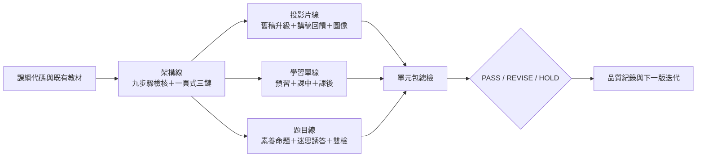

# 因材網高中物理教材產線 Skill Suite

這個 repository 把「投影片、學習單、素養題」三條產線整理成 10 個可組合的 Codex Skills，並用共用的第五學習階段課綱、九步驟架構、三面向八準則、術語表與品質紀錄，降低教師重複整理與審查的負擔。

本專案的核心原則是：**先確認課綱與證據，再生成；先記錄優點與缺失，再修改；無法確認時標示 `HOLD`，不自行猜測。**

外部老師或審查者請直接從 [`REVIEWER_START_HERE.md`](REVIEWER_START_HERE.md)
開始；不需要先閱讀全部程式或取得原始教材庫。

## 依角色開始

| 角色 | 從這裡開始 |
|---|---|
| 收到審查 ZIP 的老師 | [`REVIEWER_START_HERE.md`](REVIEWER_START_HERE.md) |
| 要從 PPTX 建立審查包的人 | [`docs/getting-started.md`](docs/getting-started.md) |
| 使用 Mac 的審查者或協作者 | [`docs/macos-guide.md`](docs/macos-guide.md) |
| 要修 Skill、規準或工具的人 | [`docs/collaboration-workflow.md`](docs/collaboration-workflow.md) |
| Repo 維護與版本管理者 | [`docs/maintenance.md`](docs/maintenance.md) |

GitHub repository 目前應維持 private，直到程式與原創內容授權完成決策。GitHub
只保存可分享核心；`outputs/`、真實教材、影片與本機品質紀錄不會上傳。

## 產線總覽



## 10 個 Skills

| Skill | 用途 | 主要輸出 |
|---|---|---|
| `physics-framework-checker` | 內容型 PPT 總審查 | 九步驟、逐頁教學鏈、影音與修復藍圖 |
| `physics-one-page-architect` | 課綱到一頁式架構 | 概念鏈、探究鏈、應用鏈 |
| `physics-slide-enhancer` | 讓簡報可自學 | speaker notes、轉場、答題回饋 |
| `physics-worksheet-generator` | 三層學習單 | 預習單、課中單、課後單 |
| `physics-literacy-question-creator` | 三面向八準則命題 | 題組、詳解、自評表 |
| `physics-visual-style-guide` | 統一物理示意圖 | 受力圖、光路圖、電路圖、波形圖規格 |
| `physics-question-qa-checker` | 題目品質雙檢 | 物理、數值、圖文、誘答檢查 |
| `physics-ppt-upgrader` | 舊簡報升級 | 差距分析、升級稿、變更摘要 |
| `physics-misconception-prompting` | 迷思與誘答設計 | 迷思假設、誘答、診斷回饋 |
| `physics-unit-package-qc` | 單元教材包出貨總檢 | 跨載體一致性與上架判定 |

Skills 位於 [`.agents/skills`](.agents/skills)，共用規則放在 [`data`](data) 與 [`references`](references)。Skills 本身保持精簡，不各自複製課綱與評分規準。

## 五分鐘開始

需求：Python 3.11 以上。核心索引、抽取、驗證只使用 Python 標準函式庫；從官方 PDF 重建課綱目錄時才需要 `pdfplumber`。

核心 Python 工具、GitHub 協作及離線審查工作台可在 Windows 與 macOS 使用。
PowerPoint 實際播放匯出與 speaker notes 自動寫回目前依賴 Windows；Mac 使用者
請依 [`macOS 使用指南`](docs/macos-guide.md) 與指定的 Windows 匯出者分工。

1. 複製本機設定：

   ```powershell
   Copy-Item config/project.example.toml config/project.toml
   ```

2. 修改 `config/project.toml` 的教材、LLM-wiki、官方課綱 PDF 與輸出路徑。`config/project.toml` 不進版控。

3. 驗證 Skill Suite：

   ```powershell
   python scripts/audit_repository.py
   python scripts/validate_suite.py
   python -m unittest discover -s tests -v
   ```

4. 建立唯讀教材索引：

   ```powershell
   python scripts/index_materials.py "資料" --output outputs/materials-index.jsonl
   ```

5. 查詢自訂代碼所屬的官方課綱條目；技高節點會回傳課程版本、官方父層、頁碼
   與來源衝突：

   ```powershell
   python scripts/resolve_curriculum.py PEb-Vc-4-1
   python scripts/resolve_curriculum.py PBa-V.1-2-2
   ```

   四份原始節點 Excel 不會上傳；所有協作者直接使用 repo 內已去識別的節點
   目錄與覆寫決策檔。每位 collaborator 都能修改 Skill、規準、測試及節點
   覆寫，不需要 `local-data`；只有收到整批新版 Excel、要重新匯入基礎目錄時
   才需要原始檔。操作見
   [`維護手冊`](docs/maintenance.md#所有協作者都能維護節點與-skill)。

6. 建立一筆審查紀錄：

   ```powershell
   python scripts/new_review_record.py PEb-Vc-4-1 physics-framework-checker `
     --artifact-ref "materials:relative/path/to/deck.pptx" `
     --output quality/records/PEb-Vc-4-1.json
   ```

## PPTX 影音審查包

先把 PPTX 的逐頁文字、speaker notes、圖片、內嵌影片與頁面對應抽成可追溯
manifest：

```powershell
python scripts/build_pptx_review_manifest.py `
  "C:\path\to\lesson.pptx" `
  "outputs\review-packages\單元代碼_單元名稱" `
  --timestamp
```

實際資料夾會命名為
`單元代碼_單元名稱_YYYYMMDD-HHmmss`，例如
`PBa-V.1-2-2_動能_20260727-230815`。時間採執行電腦本機時間；這種格式可排序、
不含 Windows 禁用字元，並避免新一輪審查覆蓋舊結果。

若 Windows 電腦已安裝 Microsoft PowerPoint，可再用實際播放引擎匯出逐頁 PNG
與包含內嵌影片／動畫的 MP4：

```powershell
powershell -ExecutionPolicy Bypass -File scripts/export_pptx_review_assets.ps1 `
  -InputPptx "C:\path\to\lesson.pptx" `
  -OutputDir "outputs\review-packages\lesson"
```

`playback.mp4` 用來核對影片與動畫是否真的出現；若原簡報沒有錄製正式計時與旁白，
匯出長度只是技術預覽，不可當作教學時間。原始教材與審查輸出預設不進版控。

當審查包已有 `manifest.json` 與 `review-result.json`，可產生不需伺服器、
不需網路連線的逐頁審查工作台：

```powershell
python scripts/build_review_workbench.py "outputs\review-packages\lesson"
```

開啟生成的 `review-workbench.html` 後，可以篩選教學鏈斷點、影片問題與缺講稿頁，
逐頁播放內嵌影片，檢查「本頁問題 → 學生輸出 → 回饋」、九步驟、十項內容品質與
critical gates，記錄老師的 `PASS / REVISE / HOLD`，最後匯出 JSON 交給下一輪
Skill。人工意見只存在瀏覽器的本機儲存空間，教材不會因此上傳。

`review-result.json` 的可攜格式見
[`data/schemas/ppt-review-result.schema.json`](data/schemas/ppt-review-result.schema.json)；
完整判讀規則見
[`references/ppt-content-review.md`](references/ppt-content-review.md)。舊版結果沒有
逐頁教學清冊時仍可開啟，但工作台會明確標示尚未提供的欄位。

`physics-slide-enhancer` 產生逐頁講稿 JSON 後，可另存一份含 speaker notes 的
PowerPoint，不覆寫原檔：

```powershell
powershell -ExecutionPolicy Bypass -File scripts/apply_pptx_notes.ps1 `
  -InputPptx "C:\path\to\lesson.pptx" `
  -NotesJson "outputs\review-packages\lesson\speaker-notes.json" `
  -OutputPptx "outputs\review-packages\lesson\lesson-自學講稿版.pptx"
```

完成後應重新抽取 notes、由 PowerPoint 匯出逐頁 PNG／MP4，確認講稿完整且沒有
破壞投影片、動畫與內嵌影片。

## 老師的建議工作流

1. **架構先行**：用 `physics-one-page-architect` 定義三鏈，再用
   `physics-framework-checker` 總審查九步驟、逐頁教學鏈、內容充實度、物理與影音。
2. **分線製作**：投影片走 `physics-ppt-upgrader`、`physics-slide-enhancer`、`physics-visual-style-guide`；學習單走 `physics-worksheet-generator`；題目走 `physics-literacy-question-creator`、`physics-misconception-prompting`、`physics-question-qa-checker`。
3. **總裝**：用 `physics-unit-package-qc` 比對三種載體的概念、術語、難度與檔名。
4. **人工決策**：老師確認 `PASS / REVISE / HOLD`，把確認結果寫回品質紀錄。AI 不取代教師的課程與上架責任。

## 給別人審查時怎麼交付

建議分成兩份，不要把整個 10GB 教材庫交出去：

1. **可分享核心 repo**：Skills、共用規則、工具、測試、去識別案例與維護文件。
2. **單元審查包**：只包含該單元經授權的逐頁圖、必要影片、`review-workbench.html`、
   `review-result.json` 與報告。

審查者在工作台逐頁覆核後匯出 JSON；維護者把可重現問題建立成 issue，先增加
失敗測試，再修改共用規則或 Skill。完整流程見
[`docs/maintenance.md`](docs/maintenance.md)。

確認投影片與影片可提供給指定審查者後，可建立排除原始 PPTX、教師姓名檔名、
轉錄資料與多餘媒體的精簡分享包：

```powershell
python scripts/build_review_share_bundle.py `
  "outputs\review-packages\lesson" `
  "outputs\share-bundles\lesson" `
  --confirm-authorized `
  --zip
```

審查者解壓縮後只要雙擊 `index.html`；不需 Python、PowerPoint 或網路連線。

## 課綱與證據分級

- **A 級**：教育部官方課綱、正式法規或專案核定規格。
- **B 級**：經專家審定的專案手冊、正式評分規準與共識文件。
- **C 級**：已驗證且品質穩定的既有教材。
- **D 級**：LLM-wiki、舊教材、未驗證筆記或模型推論，只能作候選資料，不能單獨證明「未超綱」。

詳細規則見 [`references/evidence-policy.md`](references/evidence-policy.md) 與
[`references/stage5_curriculum_and_scope.md`](references/stage5_curriculum_and_scope.md)。
本專案已將官方第五學習階段物理條目整理成
[`data/curriculum/stage5-physics.json`](data/curriculum/stage5-physics.json)，並將
四份節點 Excel 去個資後整理成
[`data/curriculum/project-node-catalog.json`](data/curriculum/project-node-catalog.json)；
每筆保留可追溯來源、頁碼與範圍註記。團隊後續確認的修正放在
[`data/curriculum/project-node-overrides.json`](data/curriculum/project-node-overrides.json)，
避免重新匯入 Excel 時洗掉已審定決策；原始 Excel 不進版控。

## 品質紀錄與迭代

每次真實教材審查都同時記錄：

- 已表現良好、應保留的設計；
- `blocker / major / minor / suggestion` 四級缺失；
- 使用的 A–D 級證據；
- Skill 版本、人工判定與後續動作。

格式見 [`data/schemas/review-record.schema.json`](data/schemas/review-record.schema.json)，流程見 [`quality/README.md`](quality/README.md)。彙整指令：

```powershell
python scripts/summarize_quality.py quality/records/*.json
```

迭代時先增加會失敗的測試或最小重現案例，再修正共用規則或單一 Skill，最後跑完整驗證。不要只把某次答案貼回 Skill，應把可重複的判斷規則與證據來源寫入資料層。

## 資料與隱私邊界

此 repository 預設不納入 `資料/`、原始 PDF、PPTX、DOCX、教師姓名索引、生成輸出與 LLM-wiki 全文。原因是容量、個資與著作權可能不適合公開散布。公開 repo 只包含可重建的規則、結構化資料、程式、測試與去識別品質案例。

在公開前仍須由專案負責人決定程式碼與原創內容授權；詳見 [`LICENSES.md`](LICENSES.md)。

## 專案結構

```text
.github/                審查問題與 pull request 範本
.agents/skills/          10 個可攜式 Skills
archive/                 已被取代、暫不刪除的本機封存（內容不進版控）
config/                  本機設定範例
data/                    課綱、規準、術語、迷思與 schema
docs/                    設計、維護與迭代文件
local-data/              仍需使用但不可直接分享的教材與候選資料
outputs/                 每次生成的審查包與教材輸出（不進版控）
quality/                 基準、案例、已知問題與迭代紀錄
references/              共用證據與執行規則
scripts/                 索引、抽取、查詢、紀錄與驗證工具
showcase/                可公開的去識別示範
tests/                   標準函式庫 unittest 測試
```

## 貢獻

請先閱讀 [`CONTRIBUTING.md`](CONTRIBUTING.md)。修改 Skill 時需保留可攜性、證據追溯、停止條件及正反向品質紀錄；新增教材內容時需確認授權與去識別。

完整的 issue → 分支 → 測試 → PR → review → 發布流程見
[`docs/collaboration-workflow.md`](docs/collaboration-workflow.md)。所有 push 與 PR
都會由 GitHub Actions 執行 repository audit、Skill 驗證與完整測試。

首波五個 10 分鐘分享主題與真實測試輸出見 [`showcase/README.md`](showcase/README.md)，互動式結果檢視頁為 [`showcase/review.html`](showcase/review.html)。

目前套件版本見 [`VERSION`](VERSION)，歷次變更見 [`CHANGELOG.md`](CHANGELOG.md)。
