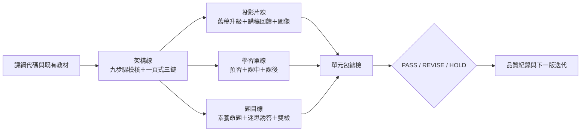

# 因材網高中物理教材產線 Skill Suite

這個 repository 把「投影片、學習單、素養題」三條產線整理成 10 個可組合的 Codex Skills，並用共用的第五學習階段課綱、九步驟架構、三面向八準則、術語表與品質紀錄，降低教師重複整理與審查的負擔。

本專案的核心原則是：**先確認課綱與證據，再生成；先記錄優點與缺失，再修改；無法確認時標示 `HOLD`，不自行猜測。**

## 產線總覽



## 10 個 Skills

| Skill | 用途 | 主要輸出 |
|---|---|---|
| `physics-framework-checker` | 九步驟架構逐頁檢核 | 保留、補頁、合併、重排清單 |
| `physics-one-page-architect` | 課綱到一頁式架構 | 概念鏈、探究鏈、應用鏈 |
| `physics-slide-enhancer` | 讓簡報可自學 | speaker notes、轉場、答題回饋 |
| `physics-worksheet-generator` | 三層學習單 | 預習單、課中單、課後單 |
| `physics-literacy-question-creator` | 三面向八準則命題 | 題組、詳解、自評表 |
| `physics-visual-style-guide` | 統一物理示意圖 | 受力圖、光路圖、電路圖、波形圖規格 |
| `physics-question-qa-checker` | 題目品質雙檢 | 物理、數值、圖文、誘答檢查 |
| `physics-ppt-upgrader` | 舊簡報升級 | 差距分析、升級稿、變更摘要 |
| `physics-misconception-prompting` | 迷思與誘答設計 | 迷思假設、誘答、診斷回饋 |
| `physics-unit-package-qc` | 單元教材包出貨總檢 | 跨載體一致性與上架判定 |

Skills 位於 [`.agents/skills`](.agents/skills)，共用規則放在 [`data`](data) 與 [`references`](references)。Skills 本身保持精簡，不各自複製課綱與評分規準。

## 五分鐘開始

需求：Python 3.11 以上。核心索引、抽取、驗證只使用 Python 標準函式庫；從官方 PDF 重建課綱目錄時才需要 `pdfplumber`。

1. 複製本機設定：

   ```powershell
   Copy-Item config/project.example.toml config/project.toml
   ```

2. 修改 `config/project.toml` 的教材、LLM-wiki、官方課綱 PDF 與輸出路徑。`config/project.toml` 不進版控。

3. 驗證 Skill Suite：

   ```powershell
   python scripts/validate_suite.py
   python -m unittest discover -s tests -v
   ```

4. 建立唯讀教材索引：

   ```powershell
   python scripts/index_materials.py "資料" --output outputs/materials-index.jsonl
   ```

5. 查詢自訂代碼所屬的官方課綱條目：

   ```powershell
   python scripts/resolve_curriculum.py PEb-Vc-4-1
   ```

6. 建立一筆審查紀錄：

   ```powershell
   python scripts/new_review_record.py PEb-Vc-4-1 physics-framework-checker `
     --artifact-ref "materials:relative/path/to/deck.pptx" `
     --output quality/records/PEb-Vc-4-1.json
   ```

## 老師的建議工作流

1. **架構先行**：用 `physics-one-page-architect` 定義三鏈，再用 `physics-framework-checker` 檢查舊簡報。
2. **分線製作**：投影片走 `physics-ppt-upgrader`、`physics-slide-enhancer`、`physics-visual-style-guide`；學習單走 `physics-worksheet-generator`；題目走 `physics-literacy-question-creator`、`physics-misconception-prompting`、`physics-question-qa-checker`。
3. **總裝**：用 `physics-unit-package-qc` 比對三種載體的概念、術語、難度與檔名。
4. **人工決策**：老師確認 `PASS / REVISE / HOLD`，把確認結果寫回品質紀錄。AI 不取代教師的課程與上架責任。

## 課綱與證據分級

- **A 級**：教育部官方課綱、正式法規或專案核定規格。
- **B 級**：經專家審定的專案手冊、正式評分規準與共識文件。
- **C 級**：已驗證且品質穩定的既有教材。
- **D 級**：LLM-wiki、舊教材、未驗證筆記或模型推論，只能作候選資料，不能單獨證明「未超綱」。

詳細規則見 [`references/evidence-policy.md`](references/evidence-policy.md) 與 [`references/stage5_curriculum_and_scope.md`](references/stage5_curriculum_and_scope.md)。本專案已將官方第五學習階段物理條目整理成 [`data/curriculum/stage5-physics.json`](data/curriculum/stage5-physics.json)；每筆保留來源頁碼與範圍註記。

## 品質紀錄與迭代

每次真實教材審查都同時記錄：

- 已表現良好、應保留的設計；
- `blocker / major / minor / suggestion` 四級缺失；
- 使用的 A–D 級證據；
- Skill 版本、人工判定與後續動作。

格式見 [`data/schemas/review-record.schema.json`](data/schemas/review-record.schema.json)，流程見 [`quality/README.md`](quality/README.md)。彙整指令：

```powershell
python scripts/summarize_quality.py quality/records/*.json
```

迭代時先增加會失敗的測試或最小重現案例，再修正共用規則或單一 Skill，最後跑完整驗證。不要只把某次答案貼回 Skill，應把可重複的判斷規則與證據來源寫入資料層。

## 資料與隱私邊界

此 repository 預設不納入 `資料/`、原始 PDF、PPTX、DOCX、教師姓名索引、生成輸出與 LLM-wiki 全文。原因是容量、個資與著作權可能不適合公開散布。公開 repo 只包含可重建的規則、結構化資料、程式、測試與去識別品質案例。

在公開前仍須由專案負責人決定程式碼與原創內容授權；詳見 [`LICENSES.md`](LICENSES.md)。

## 專案結構

```text
.agents/skills/          10 個可攜式 Skills
config/                  本機設定範例
data/                    課綱、規準、術語、迷思與 schema
docs/plans/              設計與實作計畫
quality/                 基準、案例、已知問題與迭代紀錄
references/              共用證據與執行規則
scripts/                 索引、抽取、查詢、紀錄與驗證工具
tests/                   標準函式庫 unittest 測試
```

## 貢獻

請先閱讀 [`CONTRIBUTING.md`](CONTRIBUTING.md)。修改 Skill 時需保留可攜性、證據追溯、停止條件及正反向品質紀錄；新增教材內容時需確認授權與去識別。

首波五個 10 分鐘分享主題與真實測試輸出見 [`showcase/README.md`](showcase/README.md)，互動式結果檢視頁為 [`showcase/review.html`](showcase/review.html)。

目前套件版本見 [`VERSION`](VERSION)，歷次變更見 [`CHANGELOG.md`](CHANGELOG.md)。
