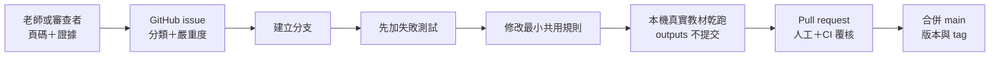

# GitHub 多人協作與維護流程

本專案把 GitHub 當成規則、程式、測試與去識別知識的正式來源，不把 GitHub
當成原始教材或每次輸出的儲存空間。

## 1. 角色與責任

| 角色 | 主要工作 | 不需負責 |
|---|---|---|
| 教材老師 | 提供教學意圖、確認優點與缺失、做最終上架判定 | 修改程式或 Git |
| 內容審查者 | 以頁碼、畫面與物理理由覆核 AI 判讀 | 上傳完整教材 |
| Skill 維護者 | 將重複問題轉成共用規則與測試 | 代替老師做課程決策 |
| Repo 管理者 | 管理 collaborator、PR、版本、tag 與公開授權 | 審定所有物理內容 |

同一個人可以兼任多個角色，但「AI 產出」與「人工上架判定」仍要分開記錄。

## 平台分工

GitHub Desktop、Git、Python 工具、Skill 維護、離線工作台與審查 ZIP 可在
Windows 與 macOS 使用。現有的 PowerPoint 實際播放匯出與 speaker notes 自動
寫回腳本依賴 Windows PowerShell 與 PowerPoint COM，因此團隊應指定至少一位
Windows 匯出者；Mac 成員不需要因此退出審查或維護流程。

| 工作 | Mac 成員 | Windows 匯出者 |
|---|---|---|
| 接受邀請、clone、分支、commit、PR | 可完成 | 可完成 |
| 修改 Skill、資料、文件與測試 | 可完成 | 可完成 |
| 建立 PPTX manifest、工作台與分享 ZIP | 可完成 | 可完成 |
| 匯出 PowerPoint 播放 MP4／逐頁 PNG | 交付來源檔 | 執行與回傳 |
| 產生講稿 JSON | 可完成 | 可完成 |
| 自動寫回 notes 並驗證 PowerPoint | 交付 JSON | 執行與回傳 |

Mac 的無終端機流程、可複製指令與交付方式見
[`macOS 使用指南`](macos-guide.md)。

## 2. Private 與 Public 邊界

目前 repository 應維持 **private**，原因是程式碼授權、原創教學內容授權與
第三方來源邊界尚未完成決策。

改成 public 前必須：

1. 選定程式碼與 Skills 的授權。
2. 選定原創規準、文件與範例的內容授權。
3. 完成第三方來源與必要引用檢查。
4. 再跑 repository audit，確認沒有個資、本機路徑與未授權教材。

詳細邊界見 [`LICENSES.md`](../LICENSES.md)。

## 3. 第一次加入

Repo 管理者在 GitHub repository 的 `Settings → Collaborators` 邀請成員。

沒有用過 GitHub 的 Mac 成員，建議先用 GitHub Desktop 接受邀請、clone、
建立分支與 PR；詳見 [`macOS 使用指南`](macos-guide.md)。

Windows PowerShell 成員接受邀請後：

```powershell
git clone https://github.com/ArpowChao/yincai-physics-skill-suite.git
Set-Location yincai-physics-skill-suite
Copy-Item config/project.example.toml config/project.toml
python scripts/validate_suite.py
python -m unittest discover -s tests -v
```

每個人自行設定 `config/project.toml`；不要把自己的路徑提交給別人。

Mac Terminal 對應指令：

```bash
git clone https://github.com/ArpowChao/yincai-physics-skill-suite.git
cd yincai-physics-skill-suite
cp config/project.example.toml config/project.toml
python3 scripts/validate_suite.py
python3 -m unittest discover -s tests -v
```

AI Agent 可以在兩種平台讀寫本機 clone；push 與 PR 仍以使用者已接受邀請且本機
GitHub 帳號有權限為前提。Agent 不會代替使用者接受 private repository 邀請。

## 4. 一個問題如何進入下一版



### 4.1 建立 issue

使用「教材／Skill 審查問題」表單，至少提供：

- 專案版本或 commit；
- 單元代碼、頁碼、影片或題號；
- 實際結果與預期結果；
- 物理、課綱、畫面或教學理由；
- `blocker / major / minor / suggestion`；
- 應保留的優點；
- 隱私與授權確認。

問題若只說「感覺不好」，維護者無法轉成測試。好的回報例如：

> 第 2 頁只有單元名稱「動能」，但本專案本來就以單元名稱作為目標；大概念應從
> S3–18 活動反推，不能因未明列而判缺失。

這類回報應轉成共用規則與回歸測試，而不是只手動改一份報告。

### 4.2 建立分支

不要直接修改 `main`：

```powershell
git switch main
git pull --ff-only
git switch -c fix/framework-infer-big-idea
```

建議命名：

- `fix/`：修正錯誤判讀或工具問題；
- `feat/`：向後相容的新能力；
- `docs/`：操作或維護文件；
- `data/`：課綱、術語、迷思與規準資料；
- `test/`：測試或最小重現案例。

### 4.3 先寫測試，再修規則

依問題所在修改：

| 問題 | 正式修改位置 |
|---|---|
| 九步驟語意 | `data/rubrics/`、`references/`、`physics-framework-checker` |
| 課綱映射 | `data/curriculum/`、解析工具與課綱測試 |
| 影片歪樓 | 內容審查規準、媒體欄位與工作台測試 |
| speaker notes | `physics-slide-enhancer` 與 notes 測試 |
| 題目答案 | 題目 QA 規則與可重算最小案例 |
| 介面 | 工作台程式與瀏覽器／HTML 測試 |

可跨單元共用的規則放 `data/`、`references/` 或 `scripts/`。不要把某份教材答案
直接寫進 Skill。

節點 Excel 由指定維護者放在本機 `local-data/sources/node-maps/`，再執行
`python scripts/build_project_node_catalog.py`。其他成員只需 pull 已去識別的
`data/curriculum/project-node-catalog.json`，不必取得原始 Excel，也能進行
範圍查詢與審查。

### 4.4 本機驗證

```powershell
python scripts/audit_repository.py
python scripts/validate_suite.py
python -m unittest discover -s tests -v
```

再用至少一份真實教材乾跑。真實教材與輸出只放 `local-data/` 或 `outputs/`，
PR 只描述結果，不附未授權檔案。

### 4.5 Commit 與 push

```powershell
git status --short
git diff --check
git add .agents data docs references scripts tests README.md CHANGELOG.md VERSION
git commit -m "fix: infer learning goal and big idea from deck evidence"
git push -u origin fix/framework-infer-big-idea
```

不要使用 `git add -f` 繞過忽略規則。提交前執行：

```powershell
git ls-files outputs local-data archive
```

除各資料夾允許追蹤的 README 外，不應列出本機內容。

### 4.6 Pull request

PR 必須說明：

- 對應 issue；
- 實際失敗案例；
- 修改的是共用規則、資料、Skill 還是工具；
- 哪些優點必須保留；
- 向後相容性與停止條件；
- 自動測試與真實教材乾跑結果；
- 是否改變 `PASS / REVISE / HOLD`。

GitHub Actions 會自動執行 repository audit、Skill 驗證與全部單元測試。CI 失敗
不得合併。

## 5. Review 與合併

建議至少取得：

- 一位熟悉該單元的物理／教材審查者；
- 一位熟悉 repo 結構與測試的維護者。

審查者依序確認：

1. 問題是否真的可重現。
2. 規則是否可套用其他單元，而非只修單一案例。
3. 是否保留原教材做得好的地方。
4. 是否新增或更新測試。
5. 是否誤放 outputs、個資、本機路徑或未授權素材。
6. 文件、schema 與工作台是否同步。

合併建議使用 squash merge，讓一個 PR 對應一個清楚的 main commit。刪除已合併
分支，避免長期分叉。

## 6. 版本與發布

- `PATCH`：文字、範例或不改輸出契約的修正。
- `MINOR`：新增欄位、規則或向後相容能力。
- `MAJOR`：改變輸入、輸出契約或既有判定語意。

發布步驟：

1. 更新 `VERSION`。
2. 更新 `CHANGELOG.md`。
3. 更新已知缺失與確認優點。
4. 跑完整測試及本機真實教材乾跑。
5. 合併 main。
6. 建立 annotated tag：

   ```powershell
   git tag -a v0.6.0 -m "PPT content review workflow"
   git push origin v0.6.0
   ```

7. 在 GitHub Release 摘要列出行為改變、遷移方式與已知限制；不要附 outputs。

## 7. 品質紀錄如何累積

- 單一案例先記錄 finding，不急著改共用規則。
- 同類問題重複或屬明確規準誤判時，建立回歸測試。
- 修正時同時記錄 strengths，避免「解決缺失」卻破壞原來好設計。
- 課綱、物理與答案衝突不能用總分抵銷。
- 人工意見與 AI 判讀分欄保存。

正式資料位置與變更分流見 [`maintenance.md`](maintenance.md)。

## 8. Repo 管理者建議設定

在 GitHub 設定：

- 預設分支：`main`；
- 合併方式：保留 squash merge；
- 刪除已合併分支；
- main 需要 pull request；
- main 需要通過 `repository-quality` CI；
- 至少一位 approval；
- 禁止 force push 與刪除 main；
- 啟用 secret scanning 與 dependency alerts（方案支援時）。

授權未定前維持 private。要邀請只審查教材、不修改程式的人，可以只傳經授權的
離線審查 ZIP，不必開放整個 repository。
