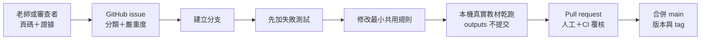

# GitHub 多人協作與維護流程

本專案把 GitHub 當成規則、程式、測試與去識別知識的正式來源，不把 GitHub
當成原始教材或每次輸出的儲存空間。

## 1. 角色與責任

| 角色 | 主要工作 | 不需負責 |
|---|---|---|
| 教材老師 | 提供教學意圖、確認優點與缺失、做最終上架判定 | 修改程式或 Git |
| 內容審查者 | 以頁碼、畫面與物理理由覆核 AI 判讀 | 上傳完整教材 |
| Skill 維護者 | 將重複問題轉成共用規則與測試 | 代替老師做課程決策 |
| Repo 管理者 | 管理 collaborator、PR、版本、tag 與公開授權 | 審定所有物理內容 |

同一個人可以兼任多個角色，但「AI 產出」與「人工上架判定」仍要分開記錄。

## 平台分工

GitHub Desktop、Git、Python 工具、Skill 維護、離線工作台與審查 ZIP 可在
Windows 與 macOS 使用。現有的 PowerPoint 實際播放匯出與 speaker notes 自動
寫回腳本依賴 Windows PowerShell 與 PowerPoint COM，因此團隊應指定至少一位
Windows 匯出者；Mac 成員不需要因此退出審查或維護流程。

| 工作 | Mac 成員 | Windows 匯出者 |
|---|---|---|
| 接受邀請、clone、分支、commit、PR | 可完成 | 可完成 |
| 修改 Skill、資料、文件與測試 | 可完成 | 可完成 |
| 建立 PPTX manifest、工作台與分享 ZIP | 可完成 | 可完成 |
| 匯出 PowerPoint 播放 MP4／逐頁 PNG | 交付來源檔 | 執行與回傳 |
| 產生講稿 JSON | 可完成 | 可完成 |
| 自動寫回 notes 並驗證 PowerPoint | 交付 JSON | 執行與回傳 |

Mac 的無終端機流程、可複製指令與交付方式見
[`macOS 使用指南`](macos-guide.md)。

## 2. Public repository 與寫入邊界

repository 為 **public**。任何人都能閱讀、clone、fork、提出 Issue，並從 fork
送出 Pull Request；只有 GitHub collaborator 能直接把工作分支推送到正式
repository。無論是否為 collaborator，`main` 都只能經 Pull Request、通過
`validate` CI 且解決討論後合併。

公開可見不等於開源授權。目前尚未選定程式碼與原創內容授權，第三方教材也沒有
因此取得再散布權。詳細邊界見 [`LICENSES.md`](../LICENSES.md)。每次提交仍須：

1. 排除原始教材、生成輸出、個資與本機路徑。
2. 檢查第三方來源與必要引用。
3. 執行 repository audit、Skill 驗證與完整測試。

## 3. 第一次加入

只需閱讀或 fork 的人不必受邀。需要直接把分支推到正式 repository 的共同維護者，
由 Repo 管理者在 GitHub `Settings → Collaborators` 邀請。

沒有用過 GitHub 的 Mac 成員，建議先用 GitHub Desktop 接受邀請、clone、
建立分支與 PR；詳見 [`macOS 使用指南`](macos-guide.md)。

Windows PowerShell 成員接受邀請後：

```powershell
git clone https://github.com/ArpowChao/yincai-physics-skill-suite.git
Set-Location yincai-physics-skill-suite
Copy-Item config/project.example.toml config/project.toml
python scripts/validate_suite.py
python -m unittest discover -s tests -v
```

每個人自行設定 `config/project.toml`；不要把自己的路徑提交給別人。

Mac Terminal 對應指令：

```bash
git clone https://github.com/ArpowChao/yincai-physics-skill-suite.git
cd yincai-physics-skill-suite
cp config/project.example.toml config/project.toml
python3 scripts/validate_suite.py
python3 -m unittest discover -s tests -v
```

AI Agent 可以在兩種平台讀寫本機 clone。Collaborator 可推送正式 repository 的
工作分支；其他人只能推送自己的 fork。Agent 不會取得超過登入帳號本身的權限。

## 4. 一個問題如何進入下一版



### 4.1 建立 issue

使用「教材／Skill 審查問題」表單，至少提供：

- 專案版本或 commit；
- 單元代碼、頁碼、影片或題號；
- 實際結果與預期結果；
- 物理、課綱、畫面或教學理由；
- `blocker / major / minor / suggestion`；
- 應保留的優點；
- 隱私與授權確認。

問題若只說「感覺不好」，維護者無法轉成測試。好的回報例如：

> 第 2 頁只有單元名稱「動能」，但本專案本來就以單元名稱作為目標；大概念應從
> S3–18 活動反推，不能因未明列而判缺失。

這類回報應轉成共用規則與回歸測試，而不是只手動改一份報告。

### 4.2 建立分支

不要直接修改 `main`：

```powershell
git switch main
git pull --ff-only
git switch -c fix/framework-infer-big-idea
```

`git pull --ff-only` 不可省略。從過期的本機 `main` 開分支是衝突的主要來源；
若這一步失敗或稍後 PR 顯示衝突，處理方式見 [`§4.7`](#47-與別人的修改整併)。

建議命名：

- `fix/`：修正錯誤判讀或工具問題；
- `feat/`：向後相容的新能力；
- `docs/`：操作或維護文件；
- `data/`：課綱、術語、迷思與規準資料；
- `test/`：測試或最小重現案例。

### 4.3 先寫測試，再修規則

依問題所在修改：

| 問題 | 正式修改位置 |
|---|---|
| 九步驟語意 | `data/rubrics/`、`references/`、`physics-framework-checker` |
| 課綱映射 | `data/curriculum/`、解析工具與課綱測試 |
| 影片歪樓 | 內容審查規準、媒體欄位與工作台測試 |
| speaker notes | `physics-slide-enhancer` 與 notes 測試 |
| 題目答案 | 題目 QA 規則與可重算最小案例 |
| 介面 | 工作台程式與瀏覽器／HTML 測試 |

可跨單元共用的規則放 `data/`、`references/` 或 `scripts/`。不要把某份教材答案
直接寫進 Skill。

所有 collaborator 都能調教 Skills、規準、節點與測試。個別節點修正寫入
`data/curriculum/project-node-overrides.json`，可使用
`python scripts/set_project_node_override.py <patch.json>` 安全更新，完全不需要
原始 Excel。只有收到整批新版 Excel、要重建基礎目錄時，才從本機
`local-data/sources/node-maps/` 執行 `build_project_node_catalog.py`；重匯不會
覆蓋團隊已提交的覆寫決策。

### 4.4 本機驗證

```powershell
python scripts/audit_repository.py
python scripts/validate_suite.py
python -m unittest discover -s tests -v
```

再用至少一份真實教材乾跑。真實教材與輸出只放 `local-data/` 或 `outputs/`，
PR 只描述結果，不附未授權檔案。

### 4.5 Commit 與 push

```powershell
git status --short
git diff --check
git add .agents data docs references scripts tests README.md CHANGELOG.md VERSION
git commit -m "fix: infer learning goal and big idea from deck evidence"
git push -u origin fix/framework-infer-big-idea
```

不要使用 `git add -f` 繞過忽略規則。提交前執行：

```powershell
git ls-files outputs local-data archive
```

除各資料夾允許追蹤的 README 外，不應列出本機內容。

### 4.6 Pull request

PR 必須說明：

- 對應 issue；
- 實際失敗案例；
- 修改的是共用規則、資料、Skill 還是工具；
- 哪些優點必須保留；
- 向後相容性與停止條件；
- 自動測試與真實教材乾跑結果；
- 是否改變 `PASS / REVISE / HOLD`。

GitHub Actions 會自動執行 repository audit、Skill 驗證與全部單元測試。CI 失敗
不得合併。

### 4.7 與別人的修改整併

多人同時維護時，最常見的狀況是你和別人從同一個版本各自往下改：

```
A ── B        別人的修改，已經合併進 main
 \
  └─ C        你的修改，還在你的分支
```

Git 不會拿 B 和 C 硬比，而是同時對照共同祖先 A，因此多數情況會自動處理：

| 狀況 | 結果 |
|---|---|
| B 改甲檔，C 改乙檔 | 自動合併 |
| B、C 都改甲檔，但**不同行** | 自動合併 |
| B、C 改**同一行** | **衝突**，需要人決定 |

規則：**先合併的人不必處理，第二個要合併的人負責整併。**

#### 預防：開分支前一定要更新

九成的衝突來自「從過期的本機 `main` 開分支」。正確做法是先取回遠端狀態，
再從遠端的 `main` 開分支：

```powershell
git fetch origin
git switch -c fix/your-topic origin/main
```

`§4.2` 的 `git switch main; git pull --ff-only` 效果相同，重點都是**動手前先更新**。
若 `git pull --ff-only` 失敗，代表你的本機 `main` 已經有別人沒有的 commit，
請改用下面的流程整併，不要用 `git pull` 硬蓋。

#### 真的撞到：在自己的分支上 rebase

PR 頁面出現 `This branch has conflicts that must be resolved` 時，在本機執行：

```powershell
git fetch origin
git rebase origin/main
```

Git 會停在衝突的檔案，內容長這樣：

```text
<<<<<<< HEAD
別人的版本
=======
你的版本
>>>>>>> 你的 commit
```

用編輯器打開，**刪掉 `<<<<<<<`、`=======`、`>>>>>>>` 三行標記**，留下最終要的內容。
兩邊都要保留時就兩段都留（例如 `CHANGELOG.md` 應保留雙方條目，新版本排在上面）。
處理完：

```powershell
git add <剛才修改的檔案>
git rebase --continue
python scripts/audit_repository.py
python scripts/validate_suite.py
python -m unittest discover -s tests -v
git push --force-with-lease
```

三項驗證務必在 push 前跑，因為 rebase 會把你的修改重新套到別人的新程式上，
可能產生本機原本沒有的失敗。

`--force-with-lease` 是必要的：rebase 會重寫你的 commit，一般 push 會被拒絕。
它與 `--force` 的差別是，若遠端分支在你不知情時被別人更新過，它會拒絕覆蓋。
**只對自己的分支使用**；`main` 已由分支保護禁止 force push，見 [`§8`](#8-main-分支保護已生效)。

若分支已經有其他人接手開發，改用 merge，不要 rebase 改寫共用歷史：

```powershell
git fetch origin
git merge origin/main
```

Mac 的 git 指令與上述完全相同；GitHub Desktop 使用者可在衝突提示中選擇
「Open in editor」，處理完標記後按 Continue。

#### 無法自動合併的檔案

`.pptx`、`.docx`、`.pdf`、`.xlsx`、圖片與影片是二進位格式，Git 只能整份二選一，
沒有逐行合併。兩人同時修改同一份簡報，必然有一份要重做。這是這些副檔名列入
`.gitignore` 的原因之一（另兩個是容量與個資授權，見 `§2`）。

教材與審查輸出改以檔案交付，不走 Git：

```powershell
python scripts/build_review_share_bundle.py `
  "outputs\review-packages\lesson" "outputs\share-bundles\lesson" `
  --confirm-authorized --zip
```

`data/curriculum/project-node-overrides.json` 是多人會同時修改的文字檔，
請一律使用 `python scripts/set_project_node_override.py <patch.json>`。
它要求填寫預期舊值，若別人已先行修改就會直接擋下，比事後解衝突安全。

## 5. Review 與合併

建議至少取得：

- 一位熟悉該單元的物理／教材審查者；
- 一位熟悉 repo 結構與測試的維護者。

審查者依序確認：

1. 問題是否真的可重現。
2. 規則是否可套用其他單元，而非只修單一案例。
3. 是否保留原教材做得好的地方。
4. 是否新增或更新測試。
5. 是否誤放 outputs、個資、本機路徑或未授權素材。
6. 文件、schema 與工作台是否同步。

合併建議使用 squash merge，讓一個 PR 對應一個清楚的 main commit。刪除已合併
分支，避免長期分叉。

## 6. 版本與發布

- `PATCH`：文字、範例或不改輸出契約的修正。
- `MINOR`：新增欄位、規則或向後相容能力。
- `MAJOR`：改變輸入、輸出契約或既有判定語意。

發布步驟：

1. 更新 `VERSION`。
2. 更新 `CHANGELOG.md`。
3. 更新已知缺失與確認優點。
4. 跑完整測試及本機真實教材乾跑。
5. 合併 main。
6. 建立 annotated tag：

   ```powershell
   git tag -a v0.6.0 -m "PPT content review workflow"
   git push origin v0.6.0
   ```

7. 在 GitHub Release 摘要列出行為改變、遷移方式與已知限制；不要附 outputs。

## 7. 品質紀錄如何累積

- 單一案例先記錄 finding，不急著改共用規則。
- 同類問題重複或屬明確規準誤判時，建立回歸測試。
- 修正時同時記錄 strengths，避免「解決缺失」卻破壞原來好設計。
- 課綱、物理與答案衝突不能用總分抵銷。
- 人工意見與 AI 判讀分欄保存。

正式資料位置與變更分流見 [`maintenance.md`](maintenance.md)。

## 8. main 分支保護（已生效）

`main` 已啟用分支保護，以下規則由 GitHub 強制執行，不是慣例：

| 規則 | 設定 | 實際效果 |
|---|---|---|
| 必須經由 pull request | approvals = **0** | 不能 `git push origin main`，一律開 PR |
| 必須通過 CI | check = **`validate`** | CI 紅燈無法合併 |
| 必須先更新到最新 main | strict | 落後 main 的 PR 要先 rebase 才能合併 |
| 線性歷史 | 啟用 | 配合 squash merge，不產生分岔 |
| 禁止 force push 與刪除 | 啟用 | `main` 無法被覆蓋或刪除 |
| 未解決的討論不得合併 | 啟用 | PR 上的 review comment 要先 resolve |
| 管理員一併受限 | **啟用** | 擁有者與 AI Agent 都不能繞過 |

兩點說明：

- **approvals 設 0 是刻意的。** GitHub 不允許自己核可自己的 PR；單人維護期間若要求
  至少一位核可，任何 PR 都無法合併。等有第二位維護者再調高。
- **管理員一併受限是刻意的。** AI Agent 使用維護者本人的憑證操作，若保留管理員後門，
  等於同時對 Agent 開後門，保護會失效。

需要臨時調整時，用 GitHub 網頁 `Settings → Branches` 修改，或：

```powershell
gh api repos/ArpowChao/yincai-physics-skill-suite/branches/main/protection
```

其餘建議設定：

- 預設分支：`main`；
- 合併方式：保留 squash merge；
- 開啟 `Settings → General → Automatically delete head branches`；
- 啟用 secret scanning 與 dependency alerts。

公開 repository 不含真實教材。只審查特定教材的人仍應收到經授權的離線審查 ZIP，
不要把教材原檔或審查輸出放進公開 repository。
