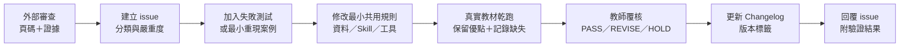

# 維護與迭代手冊

## 哪裡才是正式來源

| 內容 | 正式位置 | 不應放的位置 |
|---|---|---|
| Skill 工作流程與輸出契約 | `.agents/skills/*/SKILL.md` | 根目錄散落提示詞 |
| 課綱、術語、規準、schema | `data/` | 單一 Skill 私有複本 |
| 人類可讀的共用規則 | `references/` | 未審定 LLM-wiki 全文 |
| 可重複工具 | `scripts/` | 一次性 notebook 或聊天貼文 |
| 自動檢查 | `tests/` | 只寫在報告中的人工提醒 |
| 去識別品質案例 | `quality/examples/` | 原始教師教材 |
| 已知限制／確認優點 | `quality/known-issues.md`、`quality/confirmed-strengths.md` | 覆寫舊紀錄 |
| 本機教材與候選資料 | `local-data/` | Git 追蹤內容 |
| 已被取代的舊稿 | `archive/` | repo 根目錄 |
| 每次產出 | `outputs/` | `references/` 或 `data/` |

## 問題如何變成下一版



同一問題若只出現一次，先放進品質紀錄；在多個單元重複出現，才升級成共用規則。
不要把某一份簡報的答案直接硬寫進 Skill。

## 變更分流

- 課綱映射錯誤：修 `data/curriculum/`、解析工具與課綱測試。
- 九步驟判斷錯誤：修 `data/rubrics/` 或 `physics-framework-checker`。
- 影片與內容歪樓：補影片角色、控制變因與證據充分性測試。
- speaker notes 不足：修 `physics-slide-enhancer` 輸出契約。
- 題目物理／數值錯誤：修題目 QA 規則與最小算例測試。
- 單一教材特例：先記 `quality/records/`，不要污染共用規則。
- 介面問題：附瀏覽器、操作步驟、預期與實際結果。

## 所有協作者都能維護節點與 Skill

本專案的 collaborator 都是維護者，不區分少數「資料管理員」。以下工作完全
不需要 `local-data`：

- 修改 `.agents/skills/*/SKILL.md` 的流程與輸出契約；
- 修改 `references/`、`data/rubrics/`、schema 與測試；
- 修正個別節點的名稱、父層、範圍限制或來源衝突；
- 用去識別案例建立回歸測試並提出 PR。

基礎匯入結果位於 `data/curriculum/project-node-catalog.json`。經團隊覆核的新
決策寫入 `data/curriculum/project-node-overrides.json`，解析器會自動套用；
因此重新匯入 Excel 不會洗掉團隊後續調教結果。

建立一個本機 patch，例如放在 `outputs/node-fix.json`：

```json
{
  "code": "PBa-V.1-2-2",
  "reason": "依課綱頁碼與教師覆核修正範圍說明",
  "evidence_refs": ["curriculum:p.108", "github-issue:#12"],
  "expected": {"title": "動能"},
  "set": {
    "mapping_status": "mapped-with-source-conflict",
    "scope_constraints": ["此處填入團隊確認的新限制"]
  }
}
```

先驗證，再寫入覆寫檔：

```powershell
python scripts/set_project_node_override.py outputs/node-fix.json --check
python scripts/set_project_node_override.py outputs/node-fix.json
python scripts/resolve_curriculum.py PBa-V.1-2-2
python -m unittest tests.test_curriculum -v
```

`expected` 是防呆條件：若別人的 PR 已先改動該節點，工具會停止，要求重新讀取
最新狀態，而不是覆蓋他人的決策。`reason` 與 `evidence_refs` 必填，教師、群組、
進度等個資欄位會被拒絕。

### 何時才需要原始 Excel

只有收到整批新版節點 Excel、要重建 1,015 筆基礎匯入結果時才需要
`local-data/sources/node-maps/`。檔名需維持：

- `物A-B知識節點 07.18.xlsx`
- `SDGS教材.xlsx`
- `選修物理123_知識節點V7.xlsx`
- `選修物理4_知識節點V3.xlsx`

安裝一次 `openpyxl` 後重建基礎目錄；既有覆寫檔不會被改動：

```powershell
python -m pip install openpyxl
python scripts/build_project_node_catalog.py
python scripts/resolve_curriculum.py PBa-V.1-2-2
python -m unittest tests.test_curriculum -v
```

匯入腳本只輸出節點、課程、官方父層、範圍與工作表列號，不輸出教師、負責人、
群組或製作進度。原始 Excel 受 `.gitignore` 保護；PR 只提交 JSON、規則、測試
與必要文件。若同一代碼出現不同標題或父層，保留 `conflicts` 並透過覆寫決策
人工裁決，不可在匯入時靜默覆蓋。

## 每次發布

1. 從 issue 建立版本分支或 release PR，不直接在遠端 `main` 修改。
2. 執行 repository audit、Skill 驗證與全部單元測試。
3. 用至少一個真實但不進版控的教材審查包乾跑。
4. 更新 `quality/known-issues.md` 與 `quality/confirmed-strengths.md`。
5. 更新 `CHANGELOG.md` 與 `VERSION`。
6. 由物理／教材審查者與 repo 維護者各完成一次 review。
7. GitHub Actions 通過後合併，建立 Git tag。
8. 確認公開內容沒有個資、原始教材或本機路徑。

對外傳送單元審查包時，使用 `scripts/build_review_share_bundle.py`，不要直接壓縮
完整 `outputs/review-packages/`。分享工具會排除原始 PPTX、來源檔名、轉錄資料與
未被頁面引用的媒體，但維護者仍必須先確認頁面與影片授權。

GitHub 的分支、PR、review、CI 與 collaborator 操作見
[`collaboration-workflow.md`](collaboration-workflow.md)。

## 清理規則

- repo 根目錄只放專案入口文件與版本設定。
- 不確定是否可刪的資料移到 `archive/`，並在 `archive/README.md` 留分類。
- 仍在使用但不可分享的資料移到 `local-data/`。
- `archive/` 與 `local-data/` 不應成為正式 Skill 的必要相依。
- 每季檢查封存內容；確認有替代品且授權允許後，再由負責人決定是否刪除。
